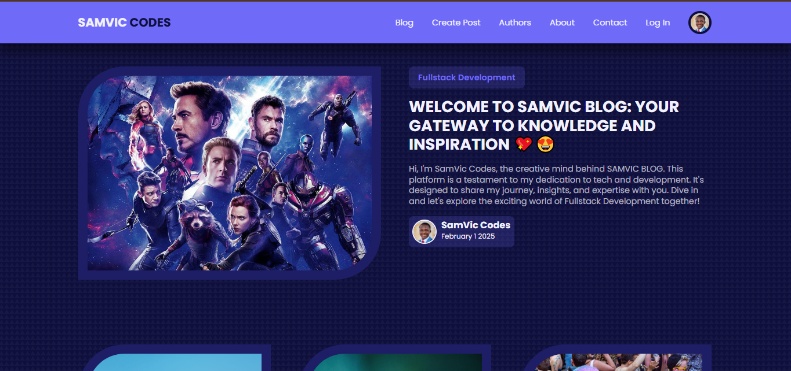
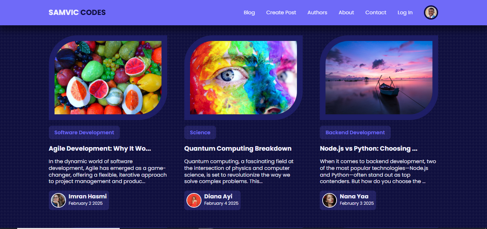
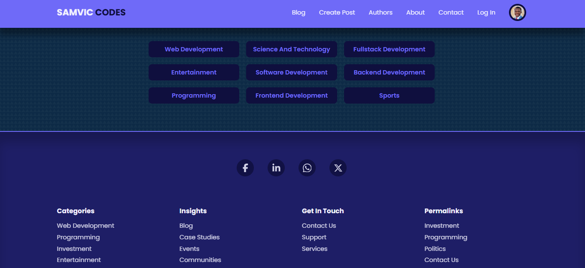
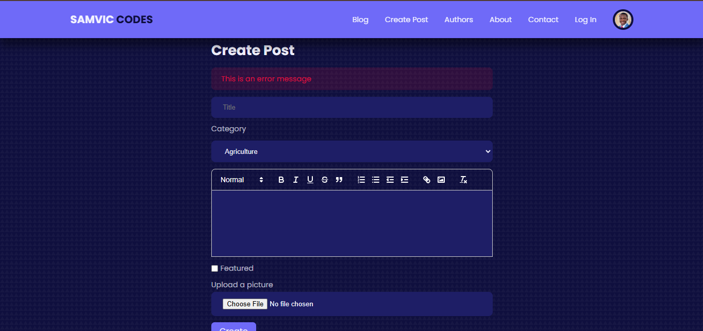
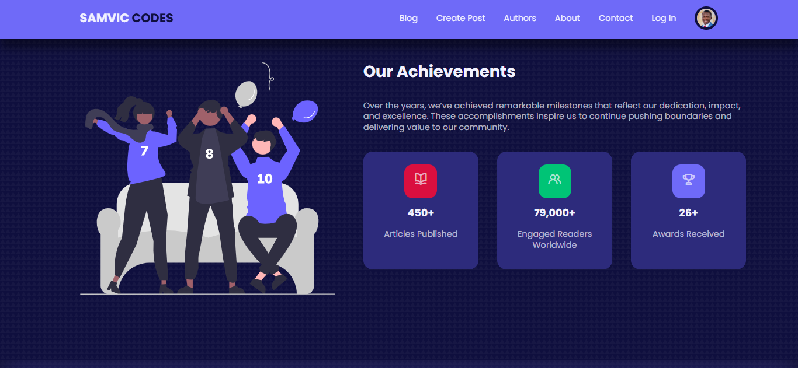
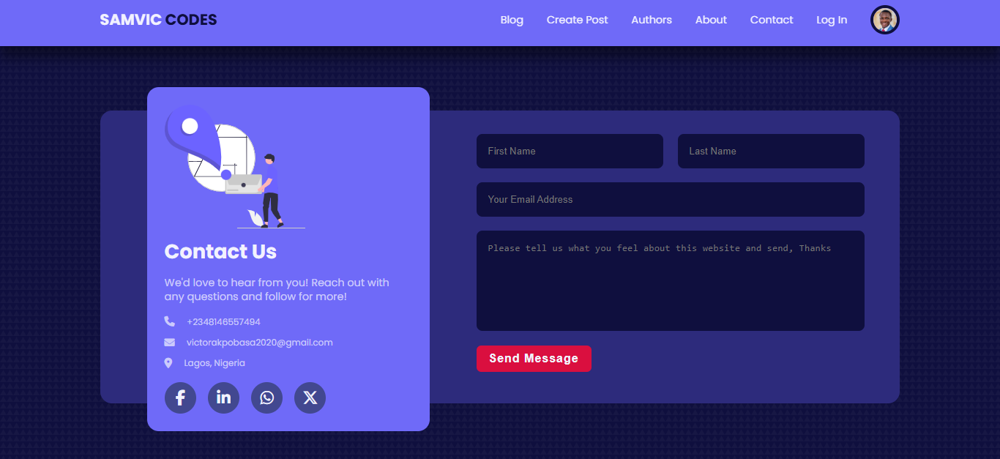
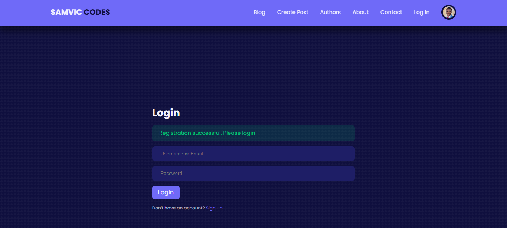
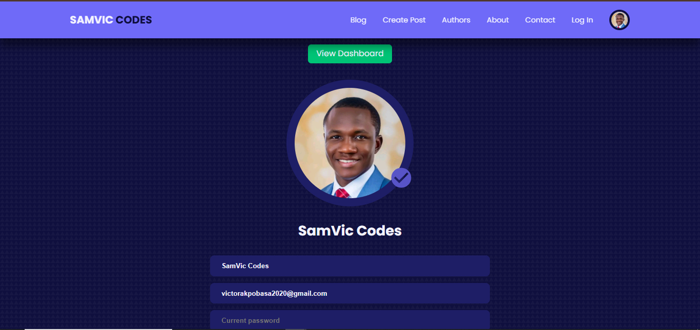

# 📝 MERN Stack Blog Application with Admin Dashboard

## 🚀 Live Demo

🔗 [Visit the Website](https://fullstack-blog-app-beta.vercel.app/)

## 🌟 About the Project

The MERN Stack Blog Application is a full-featured blogging platform designed to provide a seamless experience for both users and administrators. Built using MongoDB, Express.js, React.js, and Node.js (MERN Stack), the application includes an Admin Dashboard for content moderation, user management, and post organization.

## ✨ Features

## 🏆 User Features

🌍 Browse and read blog posts with a rich text format.
✍️ Create, edit, and delete personal blog posts.
💬 Comment on posts and engage with other users.
🔖 Bookmark favorite posts for later reading.
🎨 User Profile Management – Update avatars, personal details, and preferences.
🔍 Search and filter posts by category, tags, or keywords.
🔧 Admin Dashboard Features
📌 Post Management – Create, edit, delete, and schedule blog posts.
🎯 Featured Post Section – Highlight important/popular posts on the homepage.
👥 User Management – Update user profiles, roles, and permissions.
🏷 Category & Tag Management – Organize posts efficiently.
🛡 Real-time Moderation – Approve or delete posts and manage content.

🔒 Security & Authentication
🔑 JWT Authentication – Secure user login and session management.
🛠 Role-Based Access Control (RBAC) – Admin privileges and content control.

🚀 Tech Stack
Frontend: React.js (with Hooks & Context API), Axios, 

Backend: Node.js, Express.js, MongoDB (Mongoose ORM)

Authentication: JSON Web Tokens (JWT)

Cloud Storage: Cloudinary for image uploads

Editor: Quill.js for rich text formatting

🔧 How It Works
Users can browse, read, and interact with blog content.
Authenticated Users can create and manage their blog posts.
Admins can control user roles, manage content, and moderate the platform.

The System ensures secure authentication and authorization using JWT.

